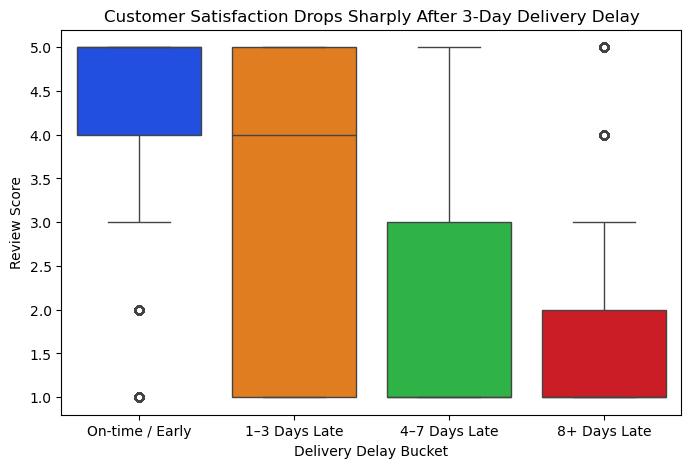
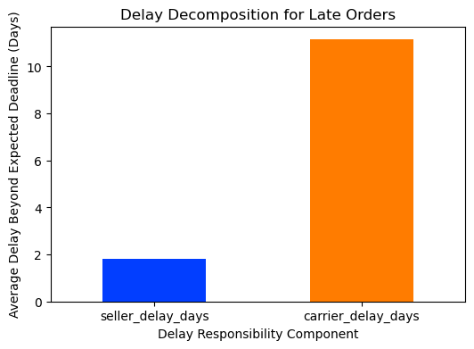
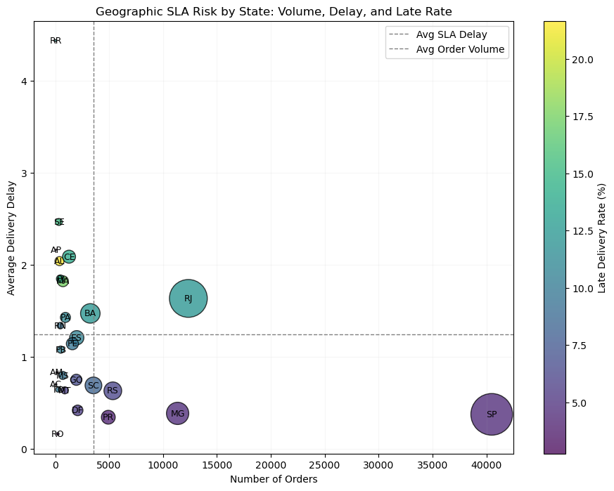

# 📦 E-commerce Logistics: Delivery Performance & Customer Satisfaction

**Understanding the drivers of late deliveries and their impact on customer satisfaction**

---

## 🔍 Project Overview

This project analyzes delivery performance in Olist’s Brazilian e-commerce marketplace to identify the primary drivers of late deliveries and quantify how logistics failures affect customer satisfaction.
Using a relational dataset of 100k+ orders, the analysis combines **SLA-based metrics**, **behavioral thresholds**, and **geographic risk signals** to surface actionable insights for logistics and operations leaders.

---

## 💼 The Business Problem

For a marketplace like Olist, delivery performance is a critical driver of customer trust, repeat purchases, and seller reputation.
Late deliveries can stem from multiple sources—seller handling delays, carrier transit issues, or geographic constraints—but without proper attribution, operational fixes risk targeting the wrong bottleneck.

**Core question:**

> *When deliveries are late, where does the breakdown actually occur—and how much does it matter to customers?*

---

## 🚀 The “So What?” — Top Insights

* **Customer tolerance for delays is non-linear:**
  Review scores remain stable up to ~3 days of delay, after which satisfaction drops sharply—revealing a clear behavioral tipping point rather than a gradual decline.

* **Carrier transit dominates SLA violations:**
  SLA-based delay decomposition shows that, for late orders, carrier-side delays contribute substantially more excess time (~11 days on average) than seller handling (~2 days), indicating most failures occur after seller handoff.

* **Geographic risk is unevenly distributed:**
  High-volume states like Rio de Janeiro (RJ) combine elevated delay rates with large customer exposure, while several low-volume states exhibit severe delays due to localized infrastructure or logistics challenges.

---

## 📊 Visual Highlights & Strategic Insights

### 1. The Satisfaction Tipping Point (Behavioral Threshold Analysis)



**Result:** *Identified a ~72-hour grace period after which delivery delays cause disproportionate drops in customer satisfaction.*

---

### 2. Identifying the True Bottleneck (SLA Delay Decomposition)



**Result:** *Demonstrated that ~85% of SLA violations originate during carrier transit rather than seller fulfillment.*

---

### 3. The Priority Matrix (Geographic SLA Risk & Impact)



**Result:** *Pinpointed Rio de Janeiro as the highest-ROI intervention zone due to its combination of high delay severity and large customer exposure.*

---

## 🧠 Key Project Features

### Relational Data Modeling

* **Integrated and denormalized 6+ relational tables** into a high-performance analytical view, enabling efficient SLA and logistics analysis at the order level.
* Preserved relational integrity while optimizing for exploratory and operational workloads.

### Bottleneck Attribution & Critical Path Analysis

* **Implemented critical-path attribution logic** for multi-seller orders, identifying the shipment leg responsible for the longest delay.
* Avoids optimistic bias from averaging and reflects the physical reality of fulfillment bottlenecks.

### Geographic Feature Engineering

* **Engineered a 1:1 ZIP-to-coordinate mapping using centroid aggregation**, resolving inconsistent geolocation records.
* Enabled national-scale distance and regional performance analysis while maintaining relational consistency.

### The Technical Challenge

> **Converting a highly normalized e-commerce database (100k+ orders) into a single source of truth—while accounting for multi-seller shipment bottlenecks, inconsistent geolocation data, and SLA-based performance attribution.**

---

## 🛠️ Tech Stack

* **Python**
* **NumPy** — numerical operations
* **Pandas** — data wrangling & feature engineering
* **Matplotlib / Seaborn** — exploratory & explanatory visualization
* **Geopy** — distance calculations
* **Geopandas** - add support for geographic data to pandas objects.  
* **Jupyter Notebook** — reproducible analysis

---

## ▶️ How to Run

1. Clone the repository:

   ```bash
   git clone https://github.com/mohawwad93/olist-logistics-analysis.git
   cd olist-logistics-analysis
   ```

2. Install dependencies:

   ```bash
   pip install -r requirements.txt
   ```

3. Open the notebook:

   ```bash
   jupyter notebook olist_delivery_analysis.ipynb
   ```

4. Run `olist_delivery_analysis.ipynb` top to bottom.

---

## 📌 Executive Summary (TL;DR)

Delivery delays only meaningfully hurt customer satisfaction after a ~3-day threshold.
Most SLA violations occur during carrier transit rather than seller handling, making downstream logistics the dominant risk factor.
Geographic analysis reveals that regions like Rio de Janeiro combine high order volume with elevated delays, representing the highest operational priority for intervention.
